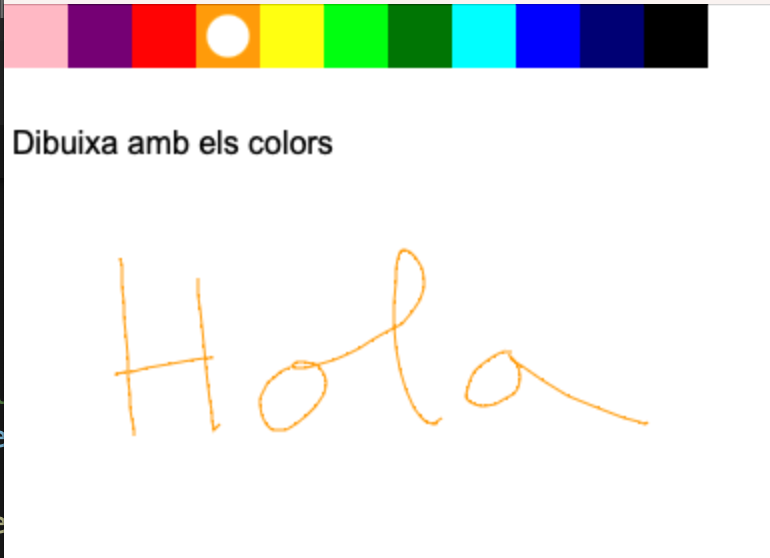

# NodeJSRailwayWebSockets
 
En aquest projecte hi ha un exemple de com comunicar implementar un GameLoop en NodeJS i comunicar-lo amb un client web amb WebSockets que funciona en Railway.

Per poder-lo executar en mode desenvolupament:

npm run dev

Per poder-lo executar a railway:

```
railway link

railway up
```

Navegar a la pàgina web que correspongui, en local: 

[http://localhost:8000](http://localhost:8000)

Captura de pantalla:

